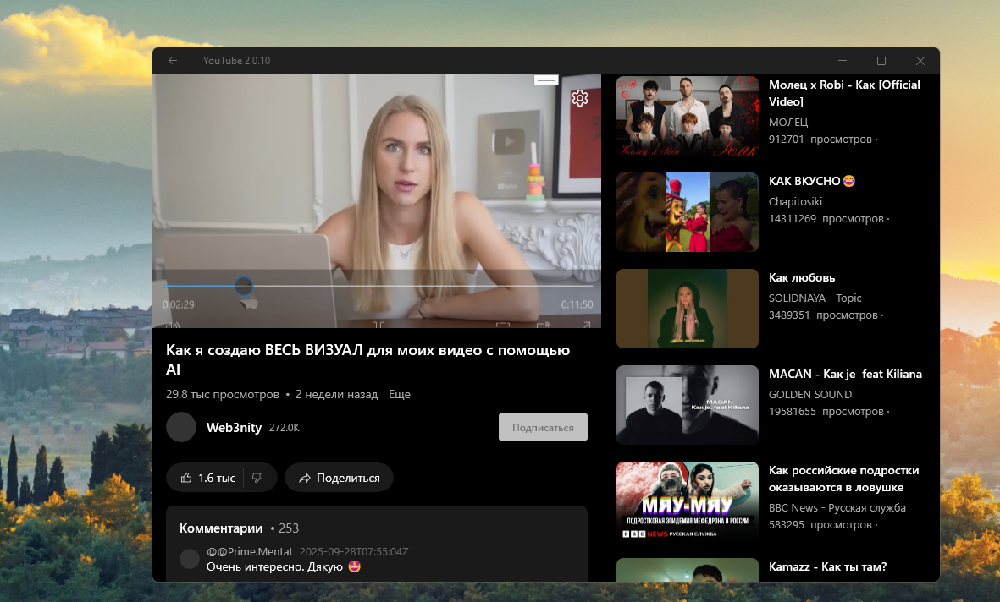
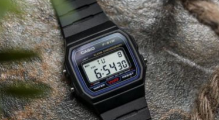

# YouTube 2.0.10 - dev branch

My fork of zemon's youtube_uwp project for my own micro-research. No less, no more! :)

## "Youtube" Instances
- https://legacyprojects.ru/youtube/ LegacyProjects (operation: 50 / 50, heh!)
- https://qqq.bccst.ru/youtube/ qqq.bccst.ru (old php version)

## Tech. details
- Win. SDK target : 19041
- Min. Win. SDK target: 10586

## Screenshot(s)

## Experimental things
- Video page binding error fixed (?)
- Short - unblocking failed (possible reason: server part uncomplete, no shorts realized yet ?)
- Subscriptions - unblocking failed (reason: I not logined?)
 
## Implemented features:
- categories
- videos from categories
- recommendations
- video search
- getting video data
- getting a direct link to the video (in various quality)
- Video from a certain person
- Getting information about the author of the video
- Comments
- Search suggestions
- authorization
- personal recommendations

## Status
- Not working in my location (95 % of errors with my google youtube api key, heh!)

## TODO
- Binding bugs still there... Try to fix them!
- Realize some video "pre-loading" (smart caching) to Video folder to aviid "offline" moments :)

## References
- https://github.com/zemonkamin/youtube_uwp Original Youtube_uwp project
- https://github.com/zemonkamin Original Youtube_uwp developer

## ..
As is. No support. RnD only. DIY.

## .
[m][e] Sep, 28 2025

