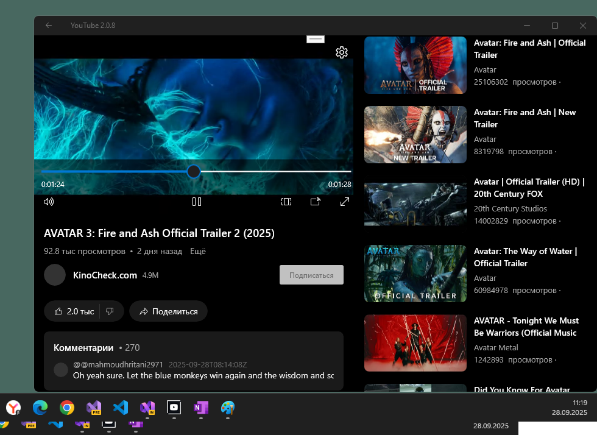

# YouTube 2.0.8 - master branch

My fork of zemon's youtube_uwp project for my own micro-research. No less, no more! :)

## "Youtube" Instances
- https://legacyprojects.ru/youtube/ LegacyProjects (operation: 50 / 50, heh!)
- https://qqq.bccst.ru/youtube/ qqq.bccst.ru (old php version)

## Screenshot(s)

## Screenshot(s)

 
## Implemented features:
- categories
- videos from categories
- recommendations
- video search
- getting video data
- getting a direct link to the video (in various quality)
- Video from a certain person
- Getting information about the author of the video
- Comments
- Search suggestions
- authorization
- personal recommendations

## Status
- Not working in my location (95 % of errors with my google youtube api key, heh!)

## References
- https://github.com/zemonkamin/youtube_uwp Original Youtube_uwp project
- https://github.com/zemonkamin Original Youtube_uwp developer

## ..
As is. No support. RnD only. DIY.

## .
[m][e] 2025
